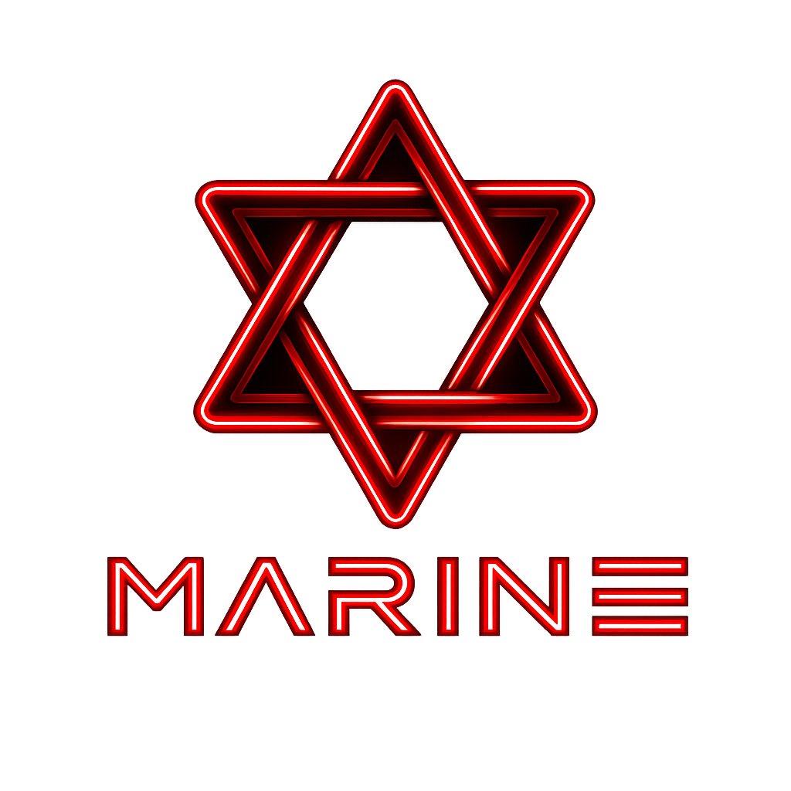

# PROFITILO

      

  
  PROFITILO

---

A modern, stylish personal portfolio to showcase skills, projects, achievements, and the journey of an aspiring student developer.

Quick links: [Website](https://marinesprofile.vercel.app) • [Repository](https://github.com/noxarix/PROFITILO)

## ✨ Highlights

- Clean, responsive single-page design with About, Projects, Skills and Contact
- Lightweight and fast — ideal for static-hosting (Vercel, Netlify, GitHub Pages)
- Student-focused with a bold, modern look

## 🖼 Screenshots

  

The README displays `assets/hero.png` (logo) and `assets/screenshot-1.png` (screenshot), which are included in the repository.

## 🤝 License

This repository is licensed under the MIT License — see the `LICENSE` file for details.

## 📦 Local development

1. Clone:

   git clone https://github.com/noxarix/PROFITILO.git
2. Serve:

   python -m http.server 3000

3. Open http://localhost:3000

---

## 🔗 Connect with me

  
  
  
  

